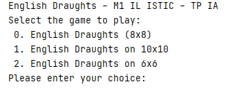
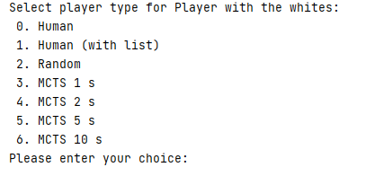
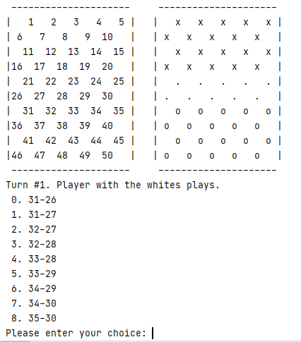
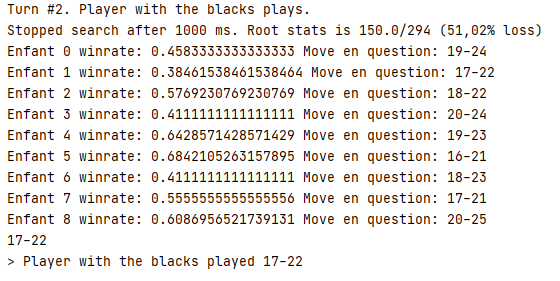

# IA - English Draughts with MCTS (Monte-Carlo Tree Search)
**Mathias DUGUE - Valentin HULOT**

Implementation of English Draughts game.  
Project for University.  

Features :
- Possibility to play with a friend or versus IA.  
- The IA is based on the MCTS algorithm.
- Different levels of IA differs by the time allowed to MCTS to compute solutions.

More information in the *.pdf files in the repository.

## Preview

### Game type selection

### Player selection

### Player turn

### Computer turn
Plays the move that minimize player 1 winrate.

## How to start

- Add "JUnit5.4" to classpath.
- Execute main() in MainGameLoop.